# Ciclos de Charlas ReLeLa

## Charlas: IA Estamos! (2026)

**IA Estamos!** es el ciclo de charlas organizado por RELELA junto al Departamento de Ciencias de la Computación (DCC), el Centro de Modelamiento Matemático (CMM) y la Iniciativa de Datos e Inteligencia Artificial (IDIA) de la Facultad de Ciencias Físicas y Matemáticas de la Universidad de Chile.

### Constanza Vásquez

**Segmentación de tumores usando imágenes de CT en datos chilenos**

*SCIAN Lab, Universidad de Chile, y Departamento de Ciencias de la Computación, Universidad de Concepción &middot; Miércoles 26 de agosto de 2026, 12:30, Auditorio Ramón Picarte, 3er piso Edificio Poniente, Av. Beauchef 851, Santiago.*

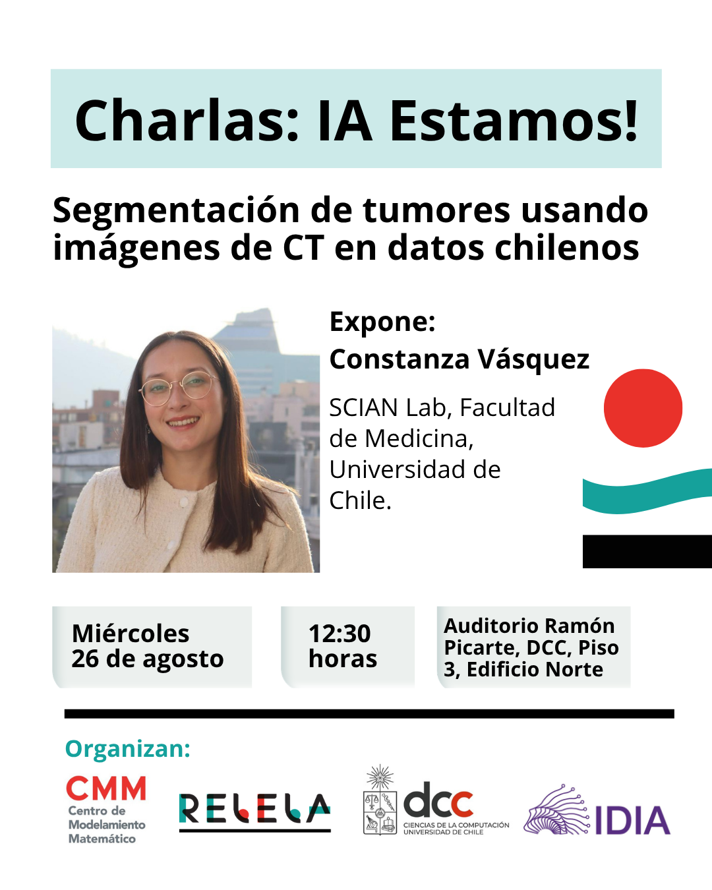

La evaluación de la respuesta al tratamiento oncológico mediante el protocolo RECIST 1.1 es el estándar clínico, pero su ejecución manual es lenta y variable entre radiólogos. Esta charla presenta un nuevo dataset público desarrollado en el Hospital Clínico de la Universidad de Chile: 1.246 lesiones segmentadas manualmente en 58 tomografías de 22 pacientes oncológicos, con mediciones RECIST 1.1 documentadas para 82 lesiones diana.

Es el primer recurso en ofrecer máscaras de segmentación por instancia para todas las lesiones medibles junto a sus mediciones clínicas correspondientes.

Se mostrará además cómo este dataset fue utilizado para entrenar y validar modelos de IA (MedSAM y nnUNet) para segmentación automática de lesiones, abriendo camino a flujos de trabajo más rápidos y reproducibles en radiología oncológica.

### José Miguel Zapata

**Framework de Evaluación de Capacidades Cognitivas de LLMs y su Aplicación al Análisis del Mercado Laboral Chileno**

*Universidad de Chile &middot; Miércoles 19 de agosto de 2026, 12:30, Auditorio Ramón Picarte, DCC, Piso 3, Edificio Norte, Av. Beauchef 851, Santiago.*

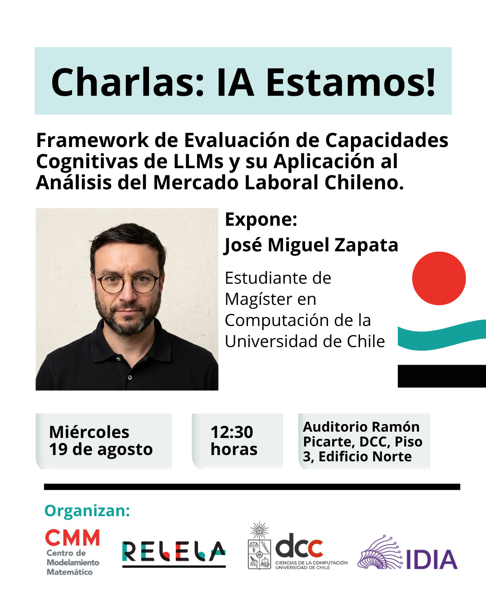

Los modelos de lenguaje de gran escala (LLMs) se han posicionado como una fuerza transformadora del mercado laboral. Sin embargo, los estudios tradicionales de exposición a la IA suelen entregar un único puntaje por ocupación, sin detallar qué capacidades cognitivas específicas están en juego.

En esta charla se presentará el Framework de Evaluación de Capacidades Cognitivas (FECC), un protocolo psicométrico basado en el modelo Cattell-Horn-Carroll que evalúa 8 LLMs (de 5 familias arquitectónicas) mediante una adaptación del test Woodcock-Johnson IV, contrastando sus capacidades con las demandas de las 200 ocupaciones principales del mercado laboral chileno.

Descubre cómo este marco permite diagnosticar con precisión qué capacidades cognitivas limitan o aceleran la exposición a la IA en distintas profesiones en Chile.

### Giovanni Castiglioni

**Learning Gaussian Embeddings from Temporal Views of Satellite Image Time Series**

*Universidad de Chile y Université Bretagne Sud &middot; Miércoles 15 de julio de 2026, 12:30, Auditorio Ramón Picarte, DCC, 3er piso Edificio Norte, Av. Beauchef 851, Santiago.*

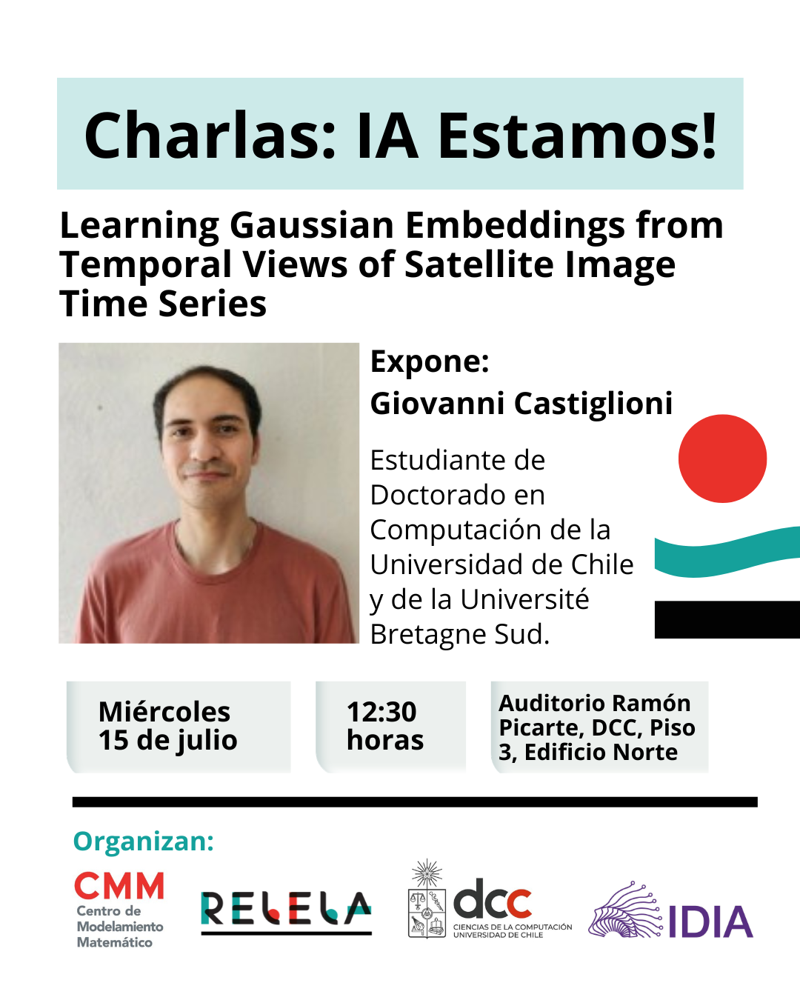

El aprendizaje autosupervisado permite aprender características útiles sin depender de muestras etiquetadas, pero el preentrenamiento de modelos fundacionales geoespaciales sobre series temporales de imágenes satelitales sigue siendo difícil por sus dependencias espaciotemporales. La charla presenta un marco basado en JEPA que extrae características con distribución normal desde datos geoespaciales multitemporales, usando vistas globales y locales basadas en agregación temporal.

El método busca representaciones robustas para tareas de teledetección y permite estimar densidad de datos geoespaciales mediante JEPA-Score. Los resultados reportados muestran mejoras frente a modelos fundacionales geoespaciales comparables en tareas como mapeo de tipos de cultivos, segmentación de áreas inundadas y detección de cicatrices de incendios forestales.

### Fabrizzio Pezzolla

**Can AI simulate public opinion?**

*Universidad de Chile &middot; Miércoles 1 de julio de 2026, 12:30, Auditorio Ramón Picarte, 3° piso edificio norte, Av. Beauchef 851, Santiago.*

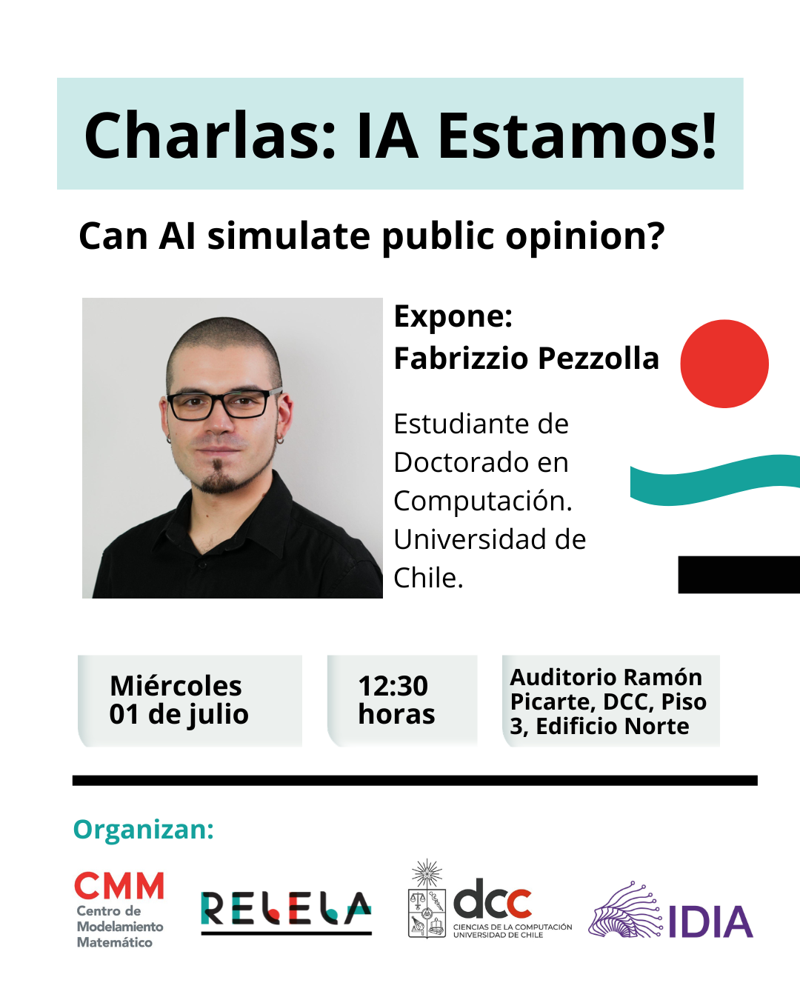

Los modelos de lenguaje permiten simular respuestas de encuestas a bajo costo, en un momento en que las encuestas tradicionales enfrentan una disminución en las tasas de respuesta, costos crecientes y la desconfianza del público. La charla ofrece una visión general de los llamados encuestados sintéticos: cómo se construyen, qué tan bien reproducen las opiniones de diferentes grupos y en qué aspectos fallan. Se revisan los principales enfoques y sus limitaciones conocidas, como la tendencia a homogeneizar las respuestas o el sesgo hacia datos en inglés y de Estados Unidos, lo que se traduce en un menor desempeño en contextos como Chile. El objetivo es analizar, de manera accesible, hasta dónde puede llegar actualmente esta tecnología y qué preguntas siguen abiertas.

**Enlaces:** [Slides](slides/2026-07-01-fabrizzio-pezzolla-public-opinion.pdf)

### Arie Wortsman Zurich

**Scaling Laws from Sequential Feature Recovery: A Solvable Model**

*Center for Data Science, ENS Paris &middot; Miércoles 24 de junio de 2026, 15:00 — Sala Multimedia CMM (6° piso, entrada por el 7°).*

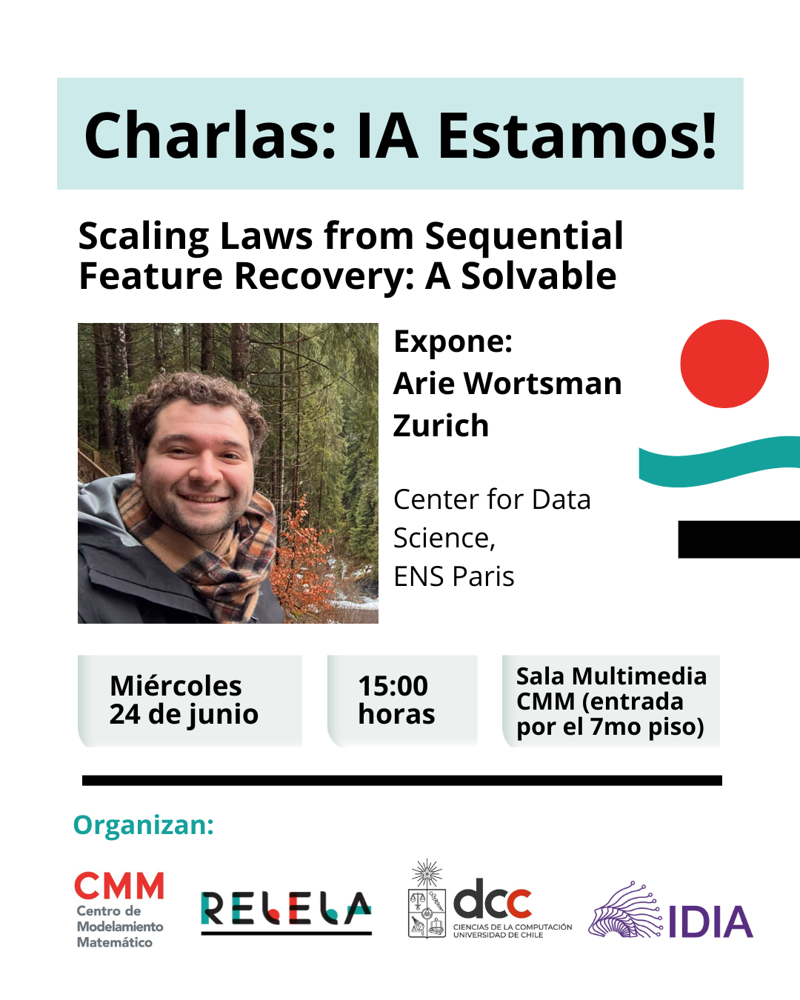

Proponemos un mecanismo simple mediante el cual las leyes de escala (scaling laws) surgen del aprendizaje de características (feature learning) en redes multicapa. Estudiamos un objetivo jerárquico de alta dimensión que es, a nivel global, una función de alto grado, pero que puede ser representado mediante una combinación de características compositivas latentes cuyos pesos disminuyen según una ley de potencias. Probamos la existencia de umbrales de recuperación precisos para cada característica y mostramos que la agregación de estas transiciones produce un decaimiento explícito en forma de ley de potencias del error de predicción. Los experimentos numéricos confirman la recuperación secuencial predicha, el suavizado de los umbrales en tamaños finitos y la separación con respecto a los modelos de referencia (baselines) de kernel no jerárquicos. En conjunto, estos resultados muestran cómo pueden surgir leyes de escala suaves a partir de una cascada de transiciones abruptas en el aprendizaje de características.

### Maximilian Leutschafft

**Need for Speed – Will AI Overtake Aerodynamic Simulations?**

*Technical University of Munich, Germany &middot; Miércoles 17 de junio de 2026, 12:30 — OpenBeauchef.*

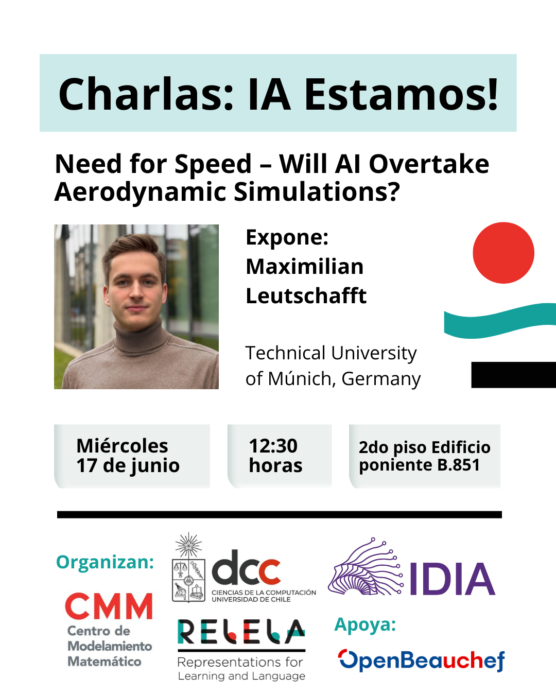

Probar diseños en simulaciones virtuales es una práctica estándar en la ingeniería moderna. Lamentablemente, estas simulaciones suelen tardar horas o incluso días en completarse, lo que limita la productividad en el área. Los modelos modernos de inteligencia artificial prometen predecir esas mismas soluciones en cuestión de segundos. Durante la presentación, cuestionaremos esta promesa, resumiremos los principios fundamentales, exploraremos soluciones de vanguardia y hablaremos sobre los obstáculos actuales.

### José Guillén

**A Simple Method to Enhance Pre-trained Language Models with Speech Tokens for Classification**

*CENIA &middot; Miércoles 3 de junio de 2026, 12:30 — OpenBeauchef, 2° piso edificio poniente, Av. Beauchef 851.*

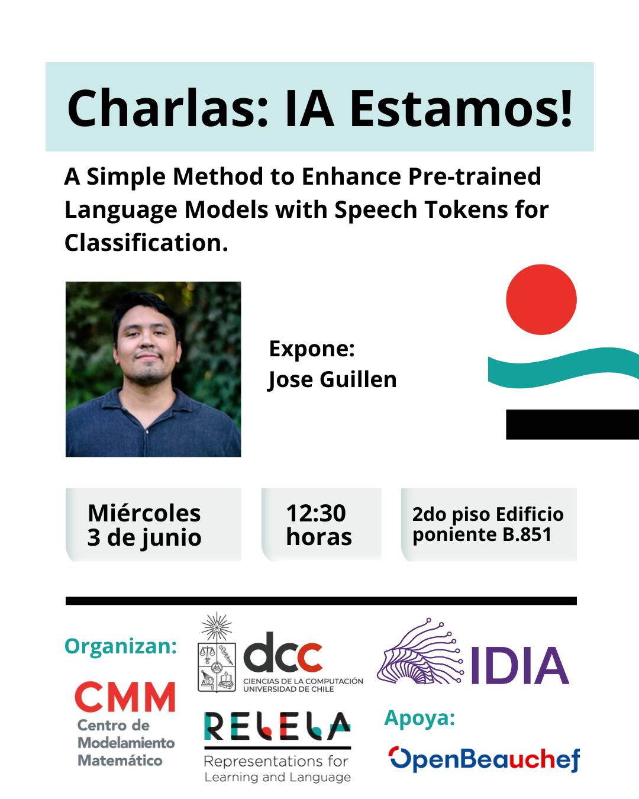

Los modelos de lenguaje suelen trabajar principalmente con texto, dejando de lado información valiosa presente en la voz, como el tono o la entonación. En esta charla se presentará un método simple y eficiente para incorporar señales de audio a modelos de lenguaje preentrenados, mejorando su desempeño en tareas de clasificación. Los resultados muestran que esta estrategia permite aprovechar información del habla de manera efectiva, obteniendo mejores resultados en aplicaciones como la detección de falacias argumentativas y el análisis de emociones.

*Sobre el expositor:* José Guillén es Research Engineer en CENIA y estudiante de magíster en la Universidad Técnica Federico Santa María. Su investigación se centra en aprendizaje multimodal, modelos de lenguaje, robótica social e inteligencia artificial aplicada a problemas ambientales.

**Enlaces:** [Artículo](https://arxiv.org/pdf/2512.07571) &middot; [Slides](slides/2026-06-03-jose-guillen-speech-tokens-classification.pdf)

### Yannis Karmim

**Understand memorisation and knowledge acquisition in LLM**

*Miércoles 6 de mayo de 2026, 12:30 — Sala P303 Philippe Flajolet, DCC.*

La charla discutió cómo los grandes modelos de lenguaje memorizan y adquieren conocimiento, a partir del trabajo en un dataset para evaluar conocimiento sobre cultura LATAM.

**Enlaces:** [Slides](slides/2026-05-06-yannis-karmim-knowledge-acquisition-llm.pdf)

---

## Ediciones anteriores

### Charlas: Las (im)posibilidades de los Modelos del Lenguaje (2023)

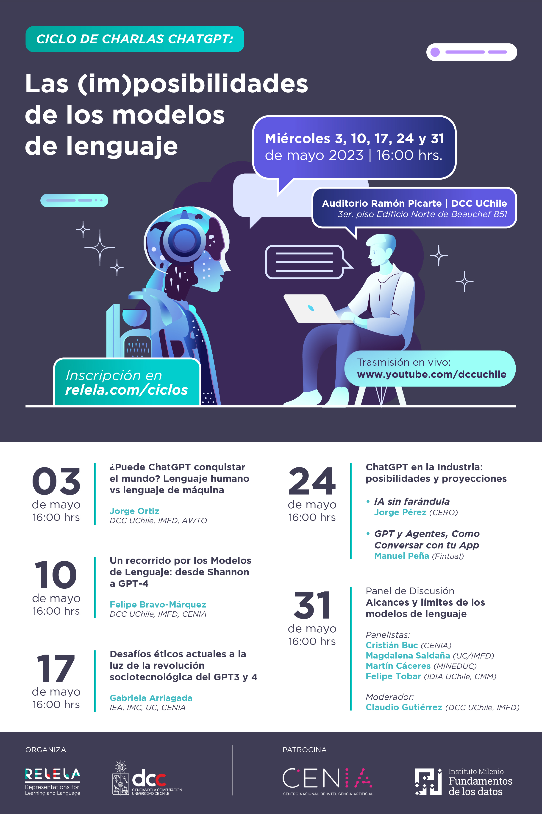 

* Lugar: Auditorio Ramón Picarte, DCC UCHILE.
* Dirección: Avenida Beauchef 851, Tercer Piso, Edificio Norte, Santiago. 
* Organización: [RELELA](https://relela.com/), [DCC Uchile](https://www.dcc.uchile.cl/). 
* Patrocinadores: [CENIA](https://cenia.cl/), [IMFD](https://imfd.cl/en/).
* Será en formato híbrido y se transmitirá a través del canal de Youtube del [DCC](https://www.youtube.com/dccuchile).

#### [Inscripciones](https://forms.gle/RjKCg7N7uPbyHgcH6)

#### Sobre el evento

La creciente importancia y la masividad que han adquirido recientemente los modelos de lenguaje como ChatGPT ha generado en la ciudadanía preocupaciones sobre sus condiciones de posibilidad y sus limitaciones. Debido a la naturaleza multidisciplinaria de la problemática, se requiere crear espacios de diálogo, difusión y la colaboración entre expertos de diferentes áreas.

El objetivo de este ciclo es brindar una visión amplia y crítica sobre el desarrollo y las posibilidades de los modelos de lenguaje, específicamente en relación a los últimos avances tecnológicos en el campo de la inteligencia artificial. Se busca explicar los fundamentos técnicos de estas tecnologías y fomentar la reflexión y el debate sobre el papel que juegan estos modelos en la sociedad actual, sus limitaciones y posibles riesgos, y las implicaciones éticas y sociales que plantean.

#### Cronograma

* Miércoles 3 de mayo 4PM
    * Presentador: Presentador: Jorge Ortiz DCC Uchile, IMFD, Awto.
    * Título: [¿Puede ChatGPT conquistar el mundo? Lenguaje humano vs lenguaje de máquina](img/ciclo/afiche-jorge-ortiz.jpg) ([slides](slides/ciclo/seminar-jorge-ortiz.pdf), [grabación](https://www.youtube.com/watch?v=ow1QV5lqQ-E&t=7s)).

* Miércoles 10 de mayo 4PM
    * Presentador: Felipe Bravo-Márquez DCC Uchile, IMFD, CENIA.
    * Título: [Un recorrido por los Modelos de Lenguaje: desde Shannon a GPT-4](img/ciclo/afiche-felipe-bravo.jpg) ([slides](slides/ciclo/seminar-felipe-bravo.pdf), [grabación](https://www.youtube.com/watch?v=XvXeSwO_9ds&t=3495s)).

* Miércoles 17 de mayo 4PM
    * Presentadora: Gabriela Arriagada, IEA, IMC, UC, CENIA.
    * Título: [Desafíos éticos actuales a la luz de la revolución sociotecnológica del GPT3 y 4](img/ciclo/afiche-gabriela-arriagada.jpg) ([slides](slides/ciclo/seminar-gabriela-arriagada.pdf), [grabación](https://www.youtube.com/watch?v=2tBIj2lTApI&t=99s)).

* Miércoles 24 de mayo 4PM 
    * Título: [ChatGPT en la Industria: posibilidades y proyecciones](img/ciclo/afiche-jp-mp-update.jpg), ([grabación](https://www.youtube.com/watch?v=nsHBAVzSKOs&t=464s)).
    * Charla 1: "IA sin farándula" por Jorge Pérez (CERO) ([slides](slides/ciclo/seminar-jorge-perez.pdf)).
    * Charla 2:  "GPT y Agentes, Como Conversar con tu App" por Manuel Peña (Fintual) ([slides](slides/ciclo/seminar-manuel-pena.pdf)).
    

* Miércoles 31 de mayo 4PM
    * Título: [Panel de Discusión  - Alcances y límites de los modelos de lenguaje](img/ciclo/afiche-conversatorio.jpg) ([grabación](https://www.youtube.com/watch?v=KhVjv7pfgBE&t=759s)).
    * Panelistas: Cristián Buc (CENIA), Magdalena Saldaña (UC/IMFD),  Martín Cáceres (MINEDUC) y Felipe Tobar (IDIA Uchile, CMM). [slides](slides/ciclo/seminar-cristian-buc.pdf) mini-presentación de Cristián Buc.
    * Moderador: Claudio Gutiérrez (DCC Uchile, IMFD).

#### Expositores

##### [Felipe Bravo-Márquez](https://felipebravom.com/)

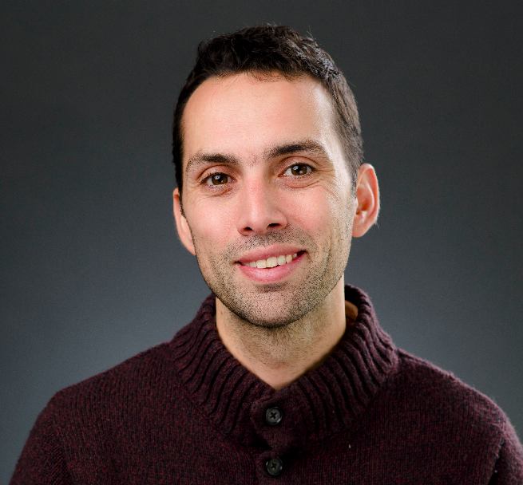 

**Profesor asistente en el Departamento de Ciencias de la Computación de la Universidad de Chile, Investigador Asociado del Centro Nacional de Inteligencia Artificial (CENIA) e Investigador Joven del Instituto Milenio Fundamento de los Datos (IMFD).**

Realizó su doctorado en el grupo Machine Learning de la Universidad de Waikato, Nueva Zelanda, donde también trabajó como Research Fellow durante dos años. Sus intereses de investigación abarcan las áreas del procesamiento del lenguaje natural (NLP), el aprendizaje automático (ML), la inteligencia artificial (AI) y la recuperación de información (IR).

##### [Jorge Ortiz Fuentes](https://www.ortizfuentes.com/)

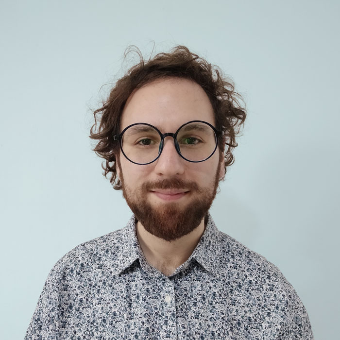  

Data Scientist y Lingüista.

**Licenciado en Letras Hispánicas de la Pontificia Universidad Católica, Magíster (c) en Ciencias de la Computación de la Universidad de Chile y Estudiante IMFD**. Sus áreas de investigación y desarrollo abarcan el procesamiento de Lenguaje Natural, la Ciencia de Datos y la Lingüística. Actualmente se desempeña como Machine Learning Engineer en Awto.

##### [Gabriela Arriagada](https://www.linkedin.com/in/gabriela-arriagada-bruneau-7a294892/)

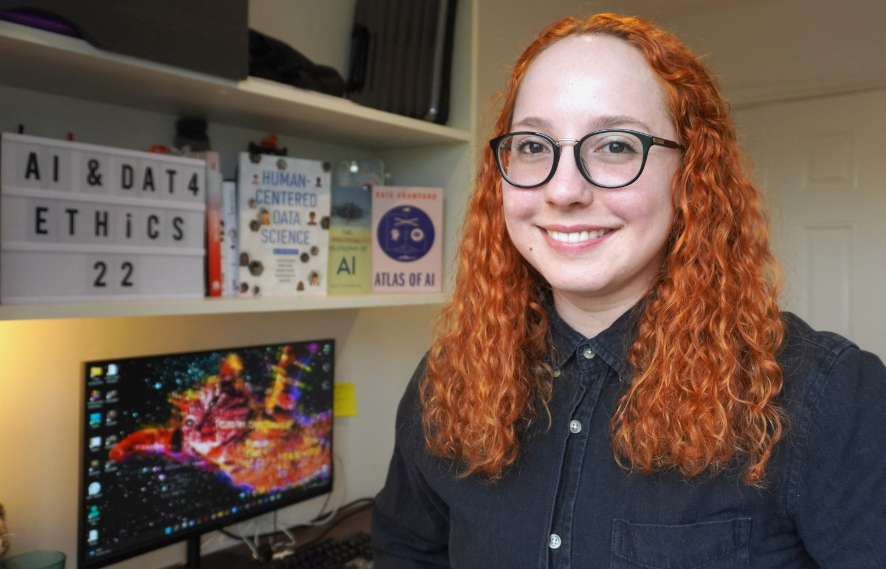 

**Profesora Asistente, Instituto de Ética Aplicada (IEA) & Instituto de Ingeniería Matemática y Computacional (IMC), UC, Investigadora CENIA. Candidata a Doctor en Filosofía y Ética Aplicada de la Universidad de Leeds, Inglaterra**.  La mayor parte de su trabajo se centra en la ética aplicada. Actualmente investiga sobre sesgo, equidad y explicabilidad en IA y ciencia de datos.

##### [Jorge Peréz](https://www.linkedin.com/in/jorge-p%C3%A9rez-a904a1214/)

 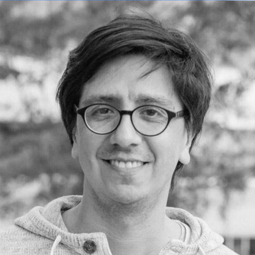  

**Co-Fundador de Cero.ai.**

Cero.ai es una empresa que apoya a que los pacientes lleguen a sus citas a la hora y preparados. Actualmente dirige el desarrollo en inteligencia artificial del  producto, y está a cargo de las  ventas a instituciones públicas de salud. Antes de cero.ai fue académico e investigador universitario por más de 15 años (DCC Uchile) y estudió un PhD en Computación (UC). Su área principal de investigación es el Procesamiento de Lenguaje Natural y Redes Neuronales Profundas.

##### [José Manuel Peña](https://www.linkedin.com/in/jose-manuel-pena/)

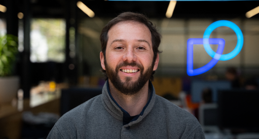 

**Senior Portfolio Manager en Fintual, Ingeniero Civil Industrial de la Universidad de Chile, Chartered Financial Analyst (CFA) y Master en Applied Analytics de la Universidad de Columbia en Nueva York**. Ha ejercido cargos en la industria financiera en áreas de análisis, desarrollo y gestión de portafolios para clientes privados y fondos de pensiones, además de haber realizado emprendimientos en áreas de analytics e inteligencia artificial. Manu también es Regional Chair del Columbia SPS Career Coalition y miembro de la comisión de Inteligencia Artificial y Big Data del Instituto de Ingenieros de Chile.

##### [Cristián Buc](https://scholar.google.com/citations?user=0gXva0YAAAAJ&hl=fr) 

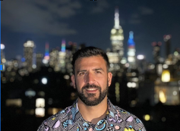 

**Investigador CENIA: Jefe del grupo científico @ CENIA. PhD en Neurociencias Computacionales Cognitivas de la Universidad Libre de Bruselas, postdoctorados en Ghent University y Brown University**. Su área de investigación emerge de la intersección entre Neurociencias e IA. En particular, su trabajo se centra en el desarrollo de redes neuronales inspiradas en funciones y mecanismos cerebrales.

##### [Magdalena Saldaña](https://comunicaciones.uc.cl/facultad/personas/magdalena-saldana-villa/)

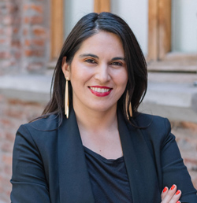 

**Profesora Asistente de la Facultad de Comunicaciones de la Pontificia Universidad Católica de Chile e investigadora del Instituto Milenio Fundamento de los Datos.**   

Doctora en Periodismo y Comunicación de Masas, University of Texas- Austin (Estados Unidos). Magíster en Investigación Social y Desarrollo, Universidad de Concepción. Periodista, Universidad de Concepción. Sus áreas de investigación son: Medios digitales, comunicación política, opinión pública y estudios latinoamericanos.

##### [Felipe Tobar](https://www.dim.uchile.cl/~ftobar/)

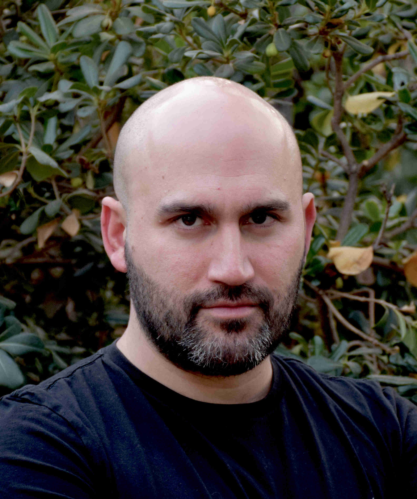 

**Profesor Asociado, Universidad de Chile,  Director, Iniciativa de Datos e Inteligencia Artificial, Uchile,  Investigador, CMM & AC3E.**

Su investigación se sitúa entre el Aprendizaje Automático Estadístico y el Procesamiento de Señales, incluyendo inferencia aproximada, inferencia no-paramétrica bayesiana, estimación espectral y transporte óptimo computacional.

##### [Martín Cáceres](https://www.linkedin.com/in/mart%C3%ADn-c%C3%A1ceres-murrie-02785289/)

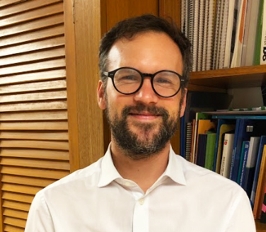 

**Director del Centro de Innovación MINEDUC. Licenciado en Física y Doctor en Ciencias de la Ingeniería de la Pontificia Universidad Católica de Chile.**

Ha trabajado como docente en el sistema escolar enseñando física, electrónica y robótica, y en el sistema universitario ha dictado cursos de humanidades digitales y metodologías innovadoras de enseñanza y aprendizaje. Además, ha trabajado en asesorías a escuelas y universidades y en política pública relacionada con innovación pedagógica en Chile y en el extranjero.

#### Afiches

##### ¿Puede ChatGPT conquistar el mundo? Lenguaje humano vs lenguaje de máquina.

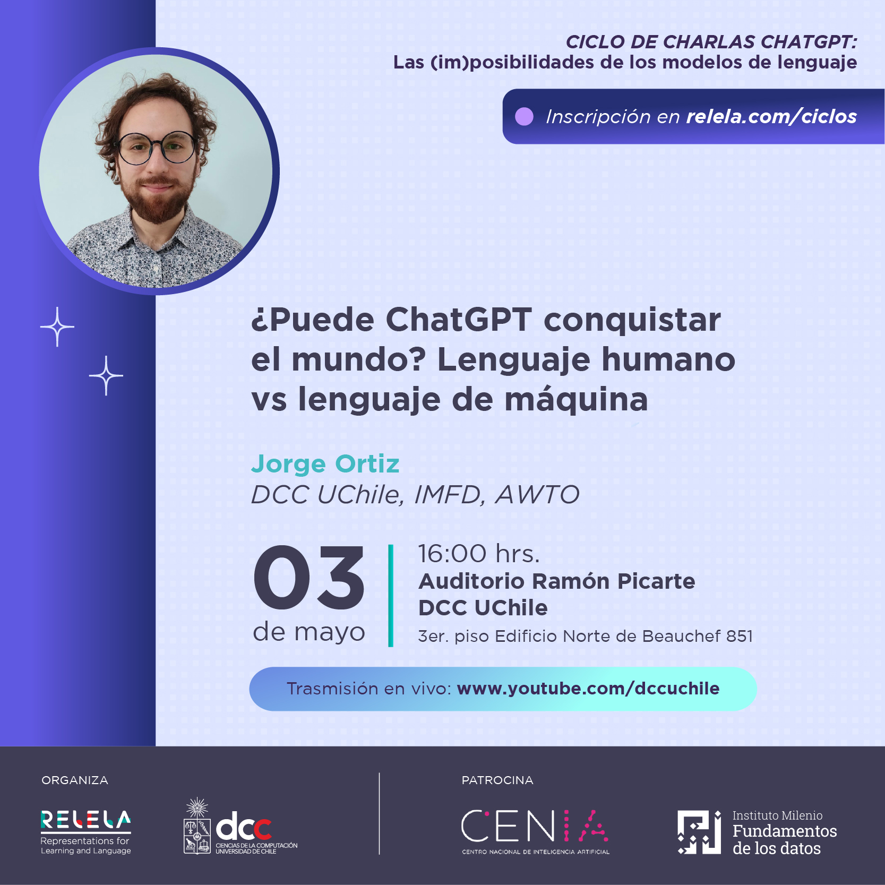  

##### Un recorrido por los Modelos de Lenguaje: desde Shannon a GPT-4.

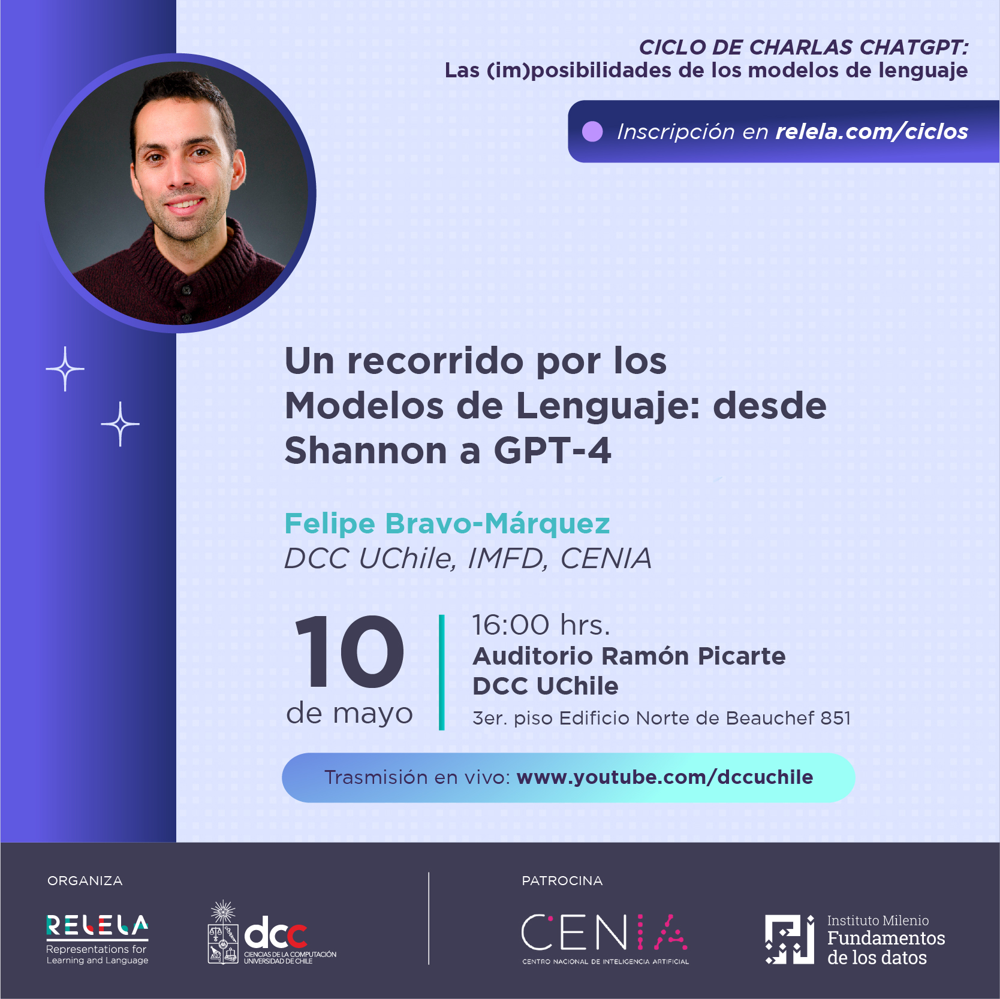

##### Desafíos éticos actuales a la luz de la revolución sociotecnológica del GPT3 y 4.

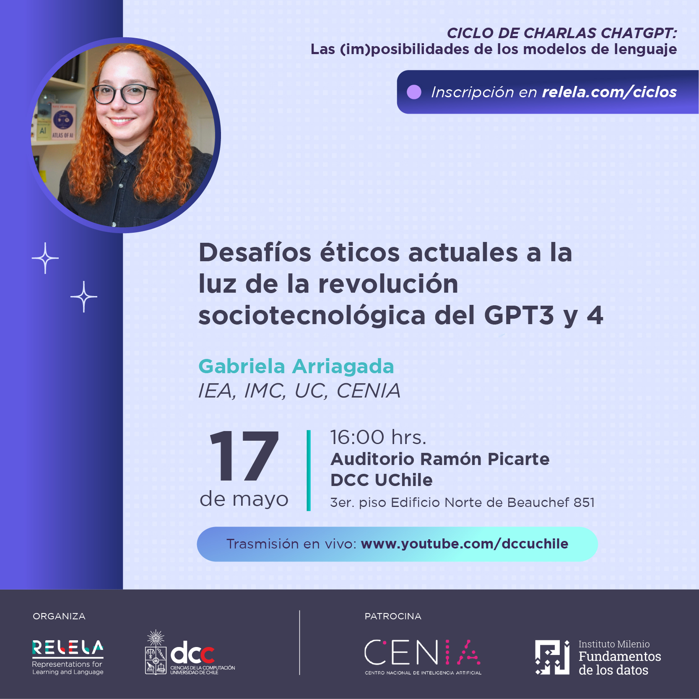

##### ChatGPT en la Industria: posibilidades y proyecciones.

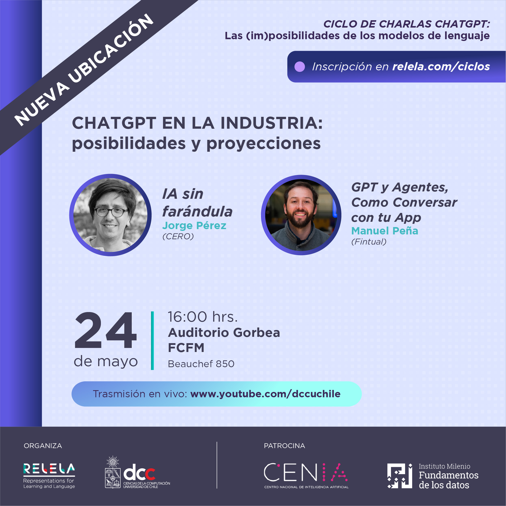

##### Alcances y límites de los modelos de lenguaje.

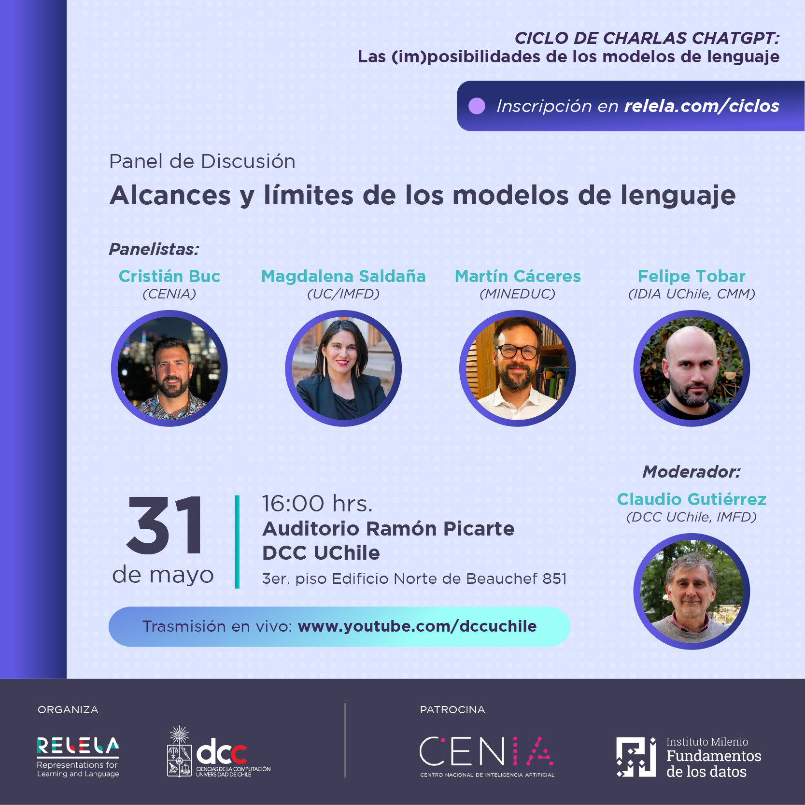
